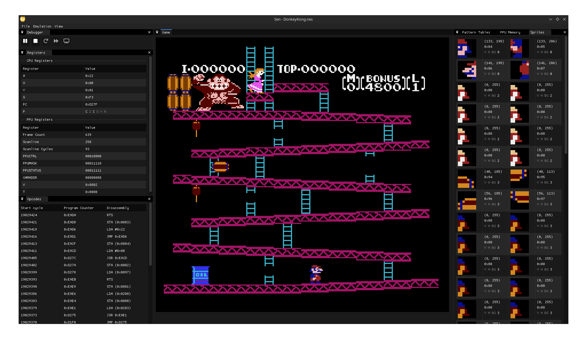

# sen - NES Emulator

`sen` is a WIP NES emulator for an NTSC NES system. Currently, it passes all CPU tests.

## Screenshots




## Building and Running

Dependencies can be managed using VCPKG. Additional dependencies are required on Linux. Run the `install_deps_ubuntu.sh` script to install them on Ubuntu/Mint/PopOS (TODO: Fedora/`dnf`).

Then configure the CMake project using:

```shell
mkdir build && cmake -S . -B build -DCMAKE_TOOLCHAIN_FILE=<path to vcpkg>/scripts/buildsystems/vcpkg.cmake -DCMAKE_BUILD_TYPE=Release 
```

If the configuration is successful it can be built using:

```shell
cmake --build build
```

Run using:

```shell
./build/sen_sdl
```

Note that the app files (for remembering open windows and layout) are stored in the working directory.

## Libraries

1. NTSC filter: [https://github.com/LMP88959/NTSC-CRT](https://github.com/LMP88959/NTSC-CRT)
